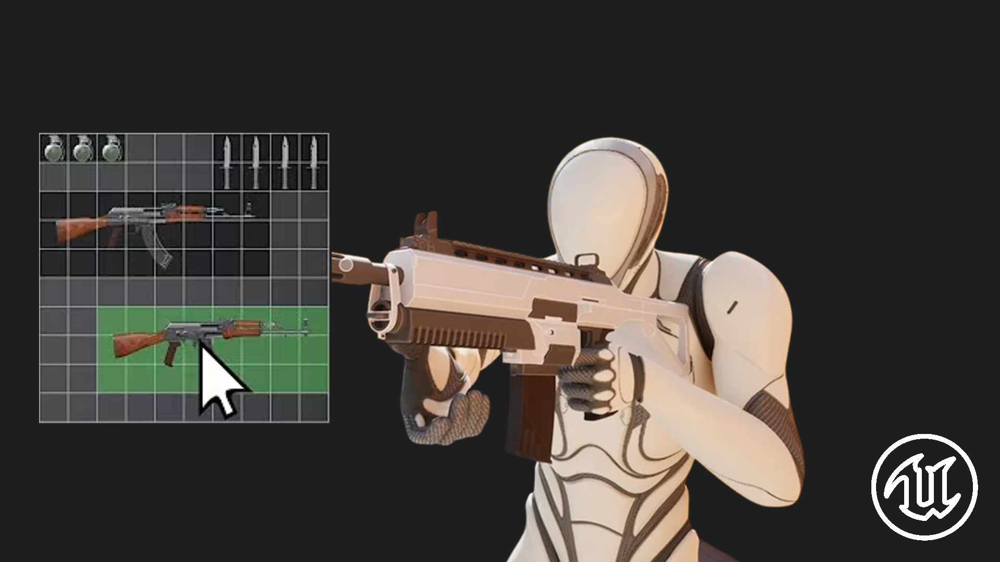

<h2 align="center">
  EU5 Inventory
</h2>

---

<div align="center">
  
</div>

<br/>

<div align="center">

[](https://forthebadge.com) &nbsp;
[](https://forthebadge.com) &nbsp;

</div>

---

## About the Project

This Unreal Engine project provides a **highly scalable inventory system**, designed to be **quick to set up** and **easy to extend**.

The main goal is to allow developers to **create a fully functional inventory grid in just a few clicks**, with support for multiple inventory types:

* **Single-slot inventory** (classic grid-based inventory)
* **Multi-slot inventory** (items occupying multiple cells, similar to a Tetris-style inventory)

The system is built with modularity in mind, making it easy to add new inventory types, rules, or item behaviors without rewriting core logic.

---

## Features

* ✅ Create inventories **in just a few clicks** (grid + UI + logic)
* ✅ Support for **single-slot** and **multi-slot** items
* ✅ **Highly scalable** architecture (multiple inventories, custom sizes, custom rules)
* ✅ Configurable items (size, icon, stackability, etc.)
* ✅ Ready-to-use UI (grid, hover, optional drag & drop)
* ✅ Easily attachable to players, chests, vendors, or any actor

---

## Documentation

All documentation is available on the **Wiki**.

➡️ **Read the full documentation here:**
[https://your-wiki-link-here](https://your-wiki-link-here)

The wiki covers:

* Inventory creation workflow
* Single-slot vs multi-slot inventories
* Item configuration
* UI setup and customization
* Integration examples (player, chest, shop, etc.)

---

## Installation

### Option 1 — Project Clone

```bash
git clone https://github.com/Rudze/UE5-InventorySystem.git
```

Open the `.uproject` file with Unreal Engine.

### Option 2 — Plugin Integration

1. Copy the plugin folder into:

```text
YourProject/Plugins/
```

---

## Example Use Cases

* 🎒 Player inventory
* 📦 Storage chest
* 🧰 Multi-slot inventory for large items
* 🛒 Shop or loot container

---

## Contact

If you have any questions, feel free to reach out at contact@rudydavid.fr

---

### Show Your Support

Give a ⭐ if you like this project!
